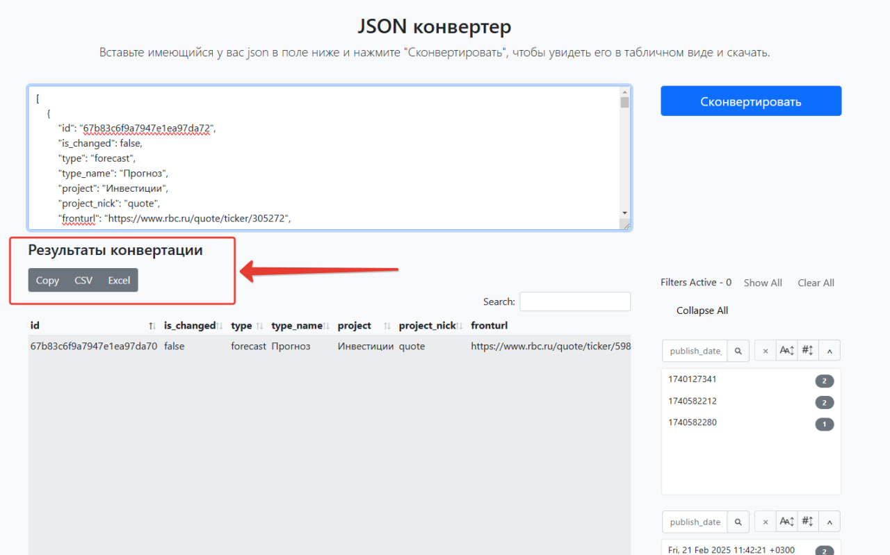

# JSON Converter  

[](https://github.com/Working-in-IT/json_converter)  
[](https://working-in-it.github.io/json_converter/)  

## Description  
**JSON Converter** is a web tool for converting structured **JSON** data into tabular formats like **Excel (XLSX)** or **CSV**. All processing occurs **locally in your browser**, ensuring data privacy and security without sending information to external servers.  

---

## How to Use  
1. **Paste Your JSON**  
   Input or paste valid JSON data into the field.  
   Example:  
   ```json  
   [  
     { "name": "John Doe", "email": "john@example.com", "age": 30 },  
     { "name": "Jane Smith", "email": "jane@example.com", "age": 28 }  
   ]  
   ```  

2. **Convert**  
   Click **"Convert"** to see the data in a table format.  

3. **Download**  
   Choose **Excel** or **CSV** format and save the file to your device.  

---

## Features  
✅ **Supports nested JSON structures** – complex data is flattened into readable tables.  
✅ **Exports to Excel and CSV** – compatible with tools like Excel, Google Sheets, and more.  
✅ **No installation required** – works directly in your browser.  
✅ **Zero data transmission** – all processing happens locally on your device.  

---

## Requirements  
- Modern web browser (Chrome, Firefox, Edge, etc.).  
- Valid JSON input format (the tool validates data integrity).  

---

## Use Case Example  
When analyzing **API responses** in browser **DevTools** (e.g., Network tab):  
1. Copy the JSON response from the API.  
2. Paste it into the converter.  
3. View and analyze the data in a table format.  

---

## Contributing  
- **Found a bug or want to improve the tool?**  
  Create an [issue](https://github.com/Working-in-IT/json_converter/issues) or submit a pull request.  
- **Support the project**  
  Share the tool with colleagues or add a ⭐ on GitHub.  

---

## Author  
Developed and maintained by: [Shevtsoff](https://github.com/dshevtsoff) 
License: MIT (see [LICENSE](LICENSE)).  

---  
**Links**  
- [Live Demo](https://working-in-it.github.io/json_converter/)  
- [Source Code on GitHub](https://github.com/Working-in-IT/json_converter)  


